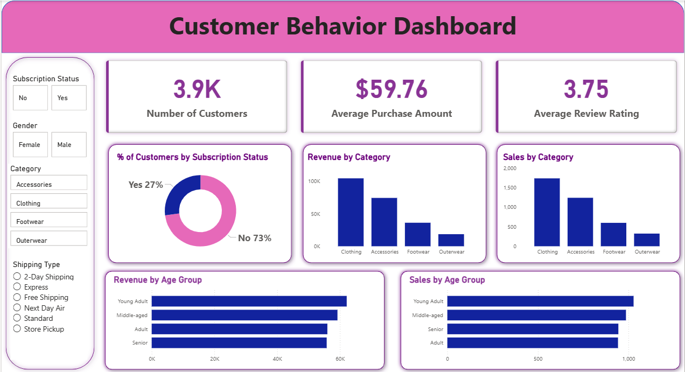
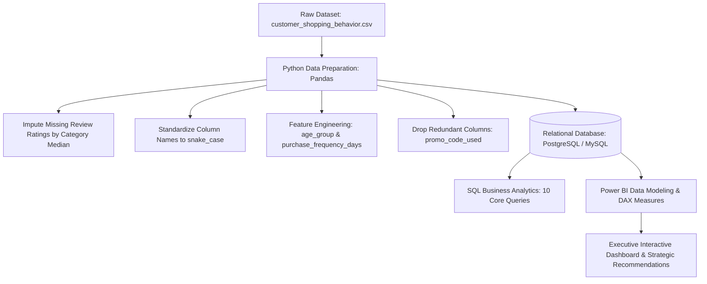

# 🛍️ Customer Shopping Behavior Analysis & BI Dashboard

[](https://www.python.org/)
[](https://pandas.pydata.org/)
[](https://www.mysql.com/)
[](https://powerbi.microsoft.com/)
[](LICENSE)

---

## 📌 Executive Summary

This end-to-end data analytics project provides an in-depth investigation into consumer purchasing patterns, demographic dynamics, discount sensitivity, and loyalty behavior for a leading retail company. By leveraging **3,900 customer transactions** across various product categories, this project translates raw transactional data into actionable business intelligence to drive revenue growth, optimize discount strategies, and improve customer retention.

The analysis follows a complete data lifecycle:
1. **Data Cleaning & Feature Engineering** using **Python (Pandas, SQLAlchemy)**.
2. **Database Integration & Advanced Business Querying** using **SQL (PostgreSQL / MySQL)**.
3. **Interactive Visual Reporting & KPI Modeling** using **Power BI**.

---

## 📊 Interactive Power BI Dashboard

The interactive **Power BI Dashboard** empowers executives and marketing managers to slice and dice customer transaction metrics dynamically by **Gender**, **Subscription Status**, **Product Category**, and **Shipping Type**.



### Key Dashboard Highlights
* **Core KPI Scorecards:** Real-time visibility into Total Customers (**3,900**), Average Order Value (**$59.76**), and Average Customer Review Rating (**3.75 / 5.0**).
* **Subscription Breakdown:** Visual donut chart displaying subscription adoption (**27% Subscribed vs. 73% Non-Subscribed**).
* **Category Performance:** Revenue and sales volume distribution across *Clothing*, *Accessories*, *Footwear*, and *Outerwear*.
* **Demographic Revenue Contribution:** Horizontal bar charts breaking down sales volume and revenue across four distinct customer age brackets.
* **Dynamic Slicers:** Comprehensive filtering across subscription tiers, gender, product categories, and fulfillment shipping methods.

---

## 📈 Key Findings & Business Insights

| Metric / Dimension | Finding | Business Implication |
| :--- | :--- | :--- |
| **Total Revenue** | **$233,081.00** across **3,900 transactions** | Average order size is **$59.76** (consistent across demographics: \$57–\$61). |
| **Gender Distribution** | **Male: $157,890 (67.7%)** \| **Female: $75,191 (32.3%)** | Men represent over two-thirds of transactions; targeted acquisition campaigns needed for women. |
| **Subscription Adoption** | **27% Subscribed (1,053)** vs. **73% Non-Subscribers (2,847)** | 72.4% of repeat buyers (>5 purchases) are *not* subscribed — huge untapped loyalty potential. |
| **Discount Sensitivity** | **50.03%** of discount users spent **≥ $59.76** (Avg Order Value) | Discounts drive substantial basket sizes and are not just attracting bargain hunters. |
| **Category Leaders** | **Clothing ($104.3K)** & **Accessories ($74.2K)** = **76.6%** of revenue | Blouse, Pants, Shirts, and Jewelry dominate sales volumes across all seasons. |
| **Customer Retention** | **79.9% Loyal (>10 purchases)**, **18.0% Returning**, **2.1% New** | High retention rate indicates strong product-market fit; growth relies on basket expansion. |
| **Age Demographics** | **Young Adults (18–31)** lead revenue generation (**$62,143**) | Young adults spend slightly higher on average (\$60.45) and purchase with higher frequency. |
| **Fulfillment Methods** | **2-Day Shipping ($60.73)** & **Express ($60.48)** have highest AOV | Expedited shipping customers have higher purchasing propensity. |

---

## 🏗️ Project Architecture & Workflow



---

## 🐍 Python Data Preparation & Feature Engineering

The initial data exploration and preprocessing were executed in [`customer_shopping_behavior.ipynb`](customer_shopping_behavior.ipynb):

1. **Handling Missing Values:** Imputed 37 missing records in `Review Rating` using the median rating per product category:
   ```python
   df['Review Rating'] = df.groupby('Category')['Review Rating'].transform(
       lambda x: x.fillna(x.median())
   )
   ```
2. **Column Standardization:** Transformed column headers to snake_case (`purchase_amount`, `review_rating`, etc.).
3. **Age Group Segmentation:** Binned customer ages into four balanced quantile tiers:
   ```python
   labels = ['Young Adult', 'Adult', 'Middle-aged', 'Senior']
   df['age_group'] = pd.qcut(df['age'], q=4, labels=labels)
   ```
4. **Purchase Frequency Mapping:** Converted qualitative purchase frequencies into operational days (`Weekly` $\rightarrow$ 7, `Fortnightly` $\rightarrow$ 14, `Monthly` $\rightarrow$ 30, `Quarterly` $\rightarrow$ 90, `Annually` $\rightarrow$ 365).
5. **Redundancy Removal:** Verified that `discount_applied` and `promo_code_used` were 100% collinear and dropped `promo_code_used`.
6. **Database Loading:** Ingested the cleaned DataFrame into a relational database using `SQLAlchemy` and database connectors.

---

## 🗄️ SQL Business Analysis & Query Highlights

All core business questions were executed via structured SQL queries in [`customer_behavior_sql_queries.sql`](customer_behavior_sql_queries.sql):

### 1. Revenue by Gender
* **Query:** Calculates total revenue per gender.
```sql
SELECT gender, SUM(purchase_amount) AS revenue
FROM customer
GROUP BY gender;
```
* **Result:** Male customers generated **$157,890**; Female customers generated **$75,191**.

---

### 2. High-Spending Discount Users
* **Query:** Identifies customers who received discounts but still spent equal to or above the overall average purchase amount ($59.76).
```sql
SELECT customer_id, purchase_amount 
FROM customer 
WHERE discount_applied = 'Yes' 
  AND purchase_amount >= (SELECT AVG(purchase_amount) FROM customer);
```
* **Result:** **839 customers** utilized discounts while maintaining high-value basket sizes.

---

### 3. Top 5 Products by Average Rating
* **Query:** Determines top-rated items to understand customer satisfaction drivers.
```sql
SELECT item_purchased, ROUND(AVG(review_rating::numeric), 2) AS "Average Product Rating"
FROM customer
GROUP BY item_purchased
ORDER BY AVG(review_rating) DESC
LIMIT 5;
```
* **Result:** Gloves (3.86), Sandals (3.84), Boots (3.82), Hat (3.80), and Skirt (3.78).

---

### 4. Shipping Method Comparison (Standard vs. Express)
* **Query:** Evaluates basket size differences across shipping options.
```sql
SELECT shipping_type, ROUND(AVG(purchase_amount), 2) AS avg_spend
FROM customer
WHERE shipping_type IN ('Standard', 'Express')
GROUP BY shipping_type;
```
* **Result:** Express shipping averages **$60.48** vs. Standard shipping at **$58.46**.

---

### 5. Subscribers vs. Non-Subscribers Revenue & Spend
* **Query:** Evaluates customer volume, average order value, and total revenue across subscription tiers.
```sql
SELECT subscription_status,
       COUNT(customer_id) AS total_customers,
       ROUND(AVG(purchase_amount), 2) AS avg_spend,
       ROUND(SUM(purchase_amount), 2) AS total_revenue
FROM customer
GROUP BY subscription_status
ORDER BY total_revenue DESC, avg_spend DESC;
```
* **Result:** Non-Subscribers generate **$170,436** (2,847 customers); Subscribers generate **$62,645** (1,053 customers).

---

### 6. Products with Highest Discount Dependency
* **Query:** Ranks products by the proportion of orders placed with discounts applied.
```sql
SELECT item_purchased,
       ROUND(100.0 * SUM(CASE WHEN discount_applied = 'Yes' THEN 1 ELSE 0 END) / COUNT(*), 2) AS discount_rate
FROM customer
GROUP BY item_purchased
ORDER BY discount_rate DESC
LIMIT 5;
```
* **Result:** Hat (50.0%), Sneakers (49.66%), Coat (49.07%), Sweater (48.17%), and Pants (47.37%).

---

### 7. Customer Loyalty Segmentation
* **Query:** Classifies customers into New (1 purchase), Returning (2–10 purchases), and Loyal (>10 purchases).
```sql
WITH customer_type AS (
    SELECT customer_id, previous_purchases,
    CASE 
        WHEN previous_purchases = 1 THEN 'New'
        WHEN previous_purchases BETWEEN 2 AND 10 THEN 'Returning'
        ELSE 'Loyal'
    END AS customer_segment
    FROM customer
)
SELECT customer_segment, COUNT(*) AS "Number of Customers" 
FROM customer_type 
GROUP BY customer_segment;
```
* **Result:** Loyal (**3,116 customers** / 79.9%), Returning (**701 customers** / 18.0%), New (**83 customers** / 2.1%).

---

### 8. Top 3 Best-Selling Products per Category
* **Query:** Employs window functions (`ROW_NUMBER() OVER PARTITION BY`) to find the top 3 items in each category.
```sql
WITH item_counts AS (
    SELECT category,
           item_purchased,
           COUNT(customer_id) AS total_orders,
           ROW_NUMBER() OVER (PARTITION BY category ORDER BY COUNT(customer_id) DESC) AS item_rank
    FROM customer
    GROUP BY category, item_purchased
)
SELECT item_rank, category, item_purchased, total_orders
FROM item_counts
WHERE item_rank <= 3;
```
* **Result:**
  * **Accessories:** Jewelry (171), Sunglasses (161), Belt (161)
  * **Clothing:** Blouse (171), Pants (171), Shirt (169)
  * **Footwear:** Sandals (160), Shoes (150), Sneakers (145)
  * **Outerwear:** Jacket (163), Coat (161)

---

### 9. Repeat Buyers Subscription Opportunity
* **Query:** Examines subscription adoption among frequent buyers (>5 previous purchases).
```sql
SELECT subscription_status,
       COUNT(customer_id) AS repeat_buyers
FROM customer
WHERE previous_purchases > 5
GROUP BY subscription_status;
```
* **Result:** Out of 3,476 repeat buyers, **2,518 (72.4%) are non-subscribers**, representing the prime target segment for subscription enrollment.

---

### 10. Revenue Contribution by Age Bracket
* **Query:** Determines revenue breakdown across demographic age tiers.
```sql
SELECT age_group,
       SUM(purchase_amount) AS total_revenue
FROM customer
GROUP BY age_group
ORDER BY total_revenue DESC;
```
* **Result:** Young Adult (**$62,143**), Middle-aged (**$59,197**), Adult (**$55,978**), Senior (**$55,763**).

---

## 🎯 Actionable Strategic Recommendations

1. **Accelerate Loyalty-to-Subscription Conversion:**
   * **Opportunity:** Over 72% of repeat buyers (>5 purchases) currently shop without a subscription.
   * **Action:** Launch in-app / checkout prompts offering subscriber perks (free express shipping, 5% loyalty cashback, early access to new collections) to convert recurring buyers into recurring revenue subscribers.
2. **Optimize Discount Margins for High-Dependency Categories:**
   * **Opportunity:** Hats, Sneakers, and Coats experience ~50% discount usage.
   * **Action:** Shift from blanket percentage markdowns to minimum-spend threshold promotions (e.g., *"Spend $75, Get $15 Off"*) to protect margins and raise the current $59.76 average order value.
3. **Gender-Specific Growth Strategies:**
   * **Opportunity:** Male customers currently generate 67.7% of total revenue.
   * **Action:** Retain male shoppers through cross-selling outerwear and accessories, while launching targeted campaigns, influencer partnerships, and category expansions for female shoppers.
4. **Leverage Expedited Shipping as a Basket Builder:**
   * **Opportunity:** Express and 2-Day shipping shoppers demonstrate the highest basket spend.
   * **Action:** Implement dynamic *"Spend $70 to unlock Free Express Shipping"* thresholds to elevate standard delivery shoppers into higher spending tiers.

---

## 📂 Project Repository Structure

```text
Customer Behavior Dashboard/
│
├── assets/
│   └── dashboard_preview.png              # Power BI dashboard screenshot preview
│
├── Business Problem  Document.pdf          # Official business requirements & problem statement
├── Customer Behavior Dashboard.pbix        # Interactive Power BI report & DAX model
├── Customer Shopping Behavior Analysis.pdf # Comprehensive analysis slide deck & findings report
├── customer_behavior_sql_queries.sql       # 10 advanced SQL business analysis queries
├── customer_shopping_behavior.csv          # Raw transactional dataset (3,900 rows, 18 columns)
├── customer_shopping_behavior.ipynb        # Python data preparation, EDA & MySQL/PostgreSQL pipeline
└── README.md                               # Project documentation & summary report
```

---

## 🚀 How to Run & Reproduce

### 1. Prerequisites
Ensure you have the following installed:
* **Python 3.8+**
* **Jupyter Notebook / VS Code**
* **MySQL** or **PostgreSQL**
* **Power BI Desktop** (for `.pbix` file viewing)

### 2. Environment Setup & Python Execution
```bash
# Clone the repository
git clone https://github.com/your-username/customer-behavior-dashboard.git
cd customer-behavior-dashboard

# Install required Python dependencies
pip install pandas numpy sqlalchemy mysql-connector-python psycopg2
```
Open and execute `customer_shopping_behavior.ipynb` to clean the raw data, generate engineered features, and export the database table.

### 3. Run SQL Queries
Load `customer_behavior_sql_queries.sql` into MySQL Workbench, pgAdmin, or your preferred SQL editor to run the analytical queries against the `customer` table.

### 4. Open Power BI Dashboard
Double-click `Customer Behavior Dashboard.pbix` in Power BI Desktop to interact with the visualizations, filter across demographics, and explore DAX measures.

---

## 📄 Dataset Dictionary

| Column Name | Data Type | Description |
| :--- | :--- | :--- |
| `Customer ID` | Integer | Unique identifier for each customer |
| `Age` | Integer | Customer's age in years (Range: 18 – 70) |
| `Gender` | String | Customer's gender (`Male`, `Female`) |
| `Item Purchased` | String | Name of the purchased item (25 distinct products) |
| `Category` | String | Broad product category (`Clothing`, `Accessories`, `Footwear`, `Outerwear`) |
| `Purchase Amount (USD)` | Float | Total dollar value spent on the transaction |
| `Location` | String | US State where the purchase occurred (50 states) |
| `Size` | String | Garment size (`S`, `M`, `L`, `XL`) |
| `Color` | String | Color of the purchased product (25 colors) |
| `Season` | String | Season of purchase (`Spring`, `Summer`, `Fall`, `Winter`) |
| `Review Rating` | Float | Customer product satisfaction rating (Scale: 1.0 – 5.0) |
| `Subscription Status` | String | Indicates if customer has active membership (`Yes`, `No`) |
| `Shipping Type` | String | Fulfillment method (`Standard`, `Express`, `2-Day Shipping`, `Next Day Air`, `Free Shipping`, `Store Pickup`) |
| `Discount Applied` | String | Indicates if a price discount was applied (`Yes`, `No`) |
| `Promo Code Used` | String | Indicates if promotional voucher was entered (`Yes`, `No`) |
| `Previous Purchases` | Integer | Total count of previous orders made with the store (1 – 50) |
| `Payment Method` | String | Method used for payment (`Credit Card`, `Debit Card`, `PayPal`, `Venmo`, `Cash`, `Bank Transfer`) |
| `Frequency of Purchases` | String | How often the customer shops (`Weekly`, `Fortnightly`, `Monthly`, `Quarterly`, `Annually`, etc.) |

---

## 👨‍💻 Author & Contributions
Developed by **Vivek** as part of the **Customer Shopping Behavior & Retail Analytics Initiative**.
Contributions, pull requests, and feedback are welcome!
# Customer-Shopping-Behavior-Analysis

